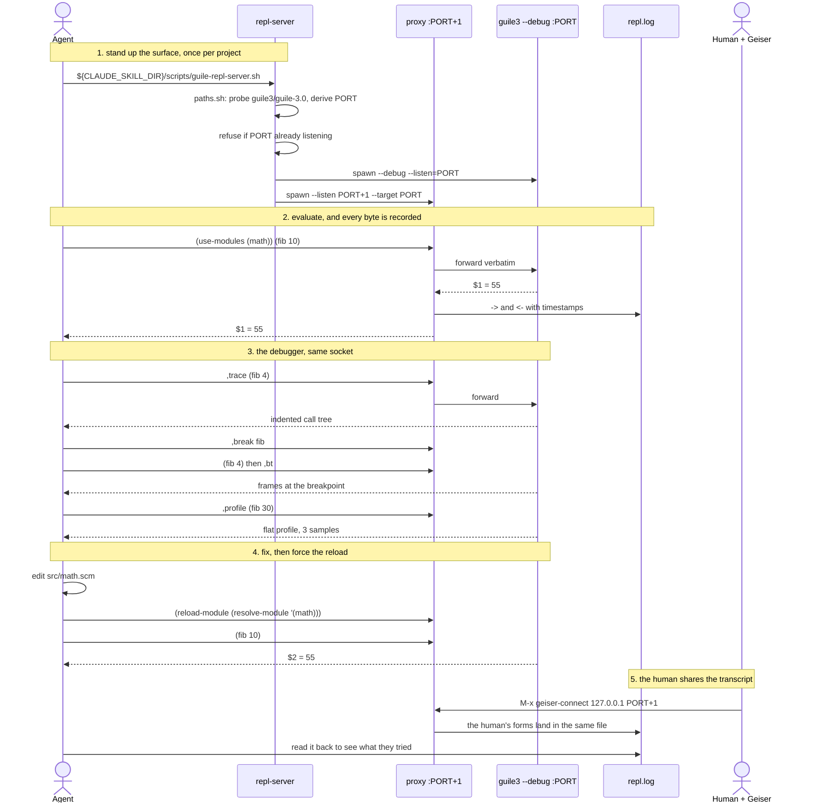

<!-- Generated from README.org by `gmake readme`. Edit the .org, not this file. -->

# guile-skills

[](LICENSE) [](https://www.gnu.org/software/guile/) [](https://github.com/dsp-dr/guile-skills/blob/main/.claude-plugin/plugin.json) [](EXPERIMENTS.org)

Three Claude Code skills that give an agent a real Guile REPL to work against instead of guessing. They start `guile3 --debug --listen` on a per-project port, record every evaluation through a logging proxy, and expose Guile's own debugger — tracing, breakpoints, macro expansion, profiling — over that same socket.

Everything stays on `127.0.0.1`. Nothing is sent anywhere.

## The three skills

| Skill | Use it when |
|----|----|
| `repl-server` | starting or resuming a Guile project: brings up the REPL and its logging proxy |
| `repl-eval` | a claim about Guile code should be checked by running it, not recalled |
| `repl-proxy` | you need a reviewable transcript of what was evaluated, or Emacs and an agent sharing one session |

## Requirements

Guile 3.x. The binary is `guile3` on FreeBSD, `guile-3.0` on Debian and Ubuntu, `guile` under Homebrew; everything here probes all three and prints which it chose. Bare `guile` is **2.2.7** on some systems and will not work.

`nc` for the eval bridge. That is the whole list — no bridge process, no daemon, no account. `guile3 --listen` is the server.

## Install

```bash
# as skills, pinned
gh skill install dsp-dr/guile-skills --pin v0.1.2

# or as a plugin, for one session
claude --plugin-dir /path/to/guile-skills
```

Then ask for what you want — "start a REPL for this project and trace `(fib 4)`" — and the matching skill loads on its own.

## Quick start from a checkout

```bash
gmake paths      # slug, ports, data directory, which guile
gmake start      # REPL on PORT, logging proxy on PORT+1
gmake status
gmake eval F='(+ 1 1)'
gmake stop
```

## How it works

    agent / Emacs+Geiser ──▶ 127.0.0.1:PORT+1 ──▶ 127.0.0.1:PORT
                                  (proxy)          (guile3 --debug --listen)
                                     │
                                     └──▶ ${CLAUDE_PLUGIN_DATA}/projects/<slug>/repl.log

The port pair is derived from the working directory, so a project — and each worktree of it — always gets its own. The transcript is keyed the same way, under the plugin's data directory rather than inside your repository, because it contains whatever you evaluated. Rotated at 4 MiB, five generations.

### A session, end to end

A real session on a project with a bug in `src/math.scm`. The point of drawing it is that each skill hands off to the next, and the debugger is reached *through* the same socket as ordinary evaluation – there is no second channel.



Where it goes quiet rather than wrong, by step:

| Step | If you skip it | What you see |
|----|----|----|
| 1, `--debug` | tracing and breakpoints do nothing | `,trace` prints **no lines and no error**, reading as "makes no calls" |
| 1, port check | a stale listener keeps serving | the new process dies, the old one answers, and your log never grows |
| 2, `PORT+1` | connect to `PORT` instead | the right answer, and nothing recorded |
| 3, `,profile` too small | nothing to sample | `No samples recorded.`, which reads as a broken profiler |
| 4, reload | the module is already loaded | the **pre-edit** answer, with no error |

Only step 5 is optional. The proxy serves connections serially, so an agent and Geiser at once needs two proxies or a threaded accept loop.

## Three things that will bite you

1.  **Bare `guile` may be 2.2.7.** Anything shelling out to `guile` then fails in ways that look like your code is wrong.
2.  **Without `--debug`, the debug surfaces silently do nothing.** `,trace (fib 4)` emits no lines **and no error**, which reads as "this procedure makes no calls". Every start path here passes `--debug`.
3.  **There is no Guile linter.** `guild3 compile -W 3` gives warnings and that is the whole story — no clj-kondo equivalent exists, so nothing here tells you to "run the linter".

[EXPERIMENTS.org](EXPERIMENTS.org) has the rest, including the four failures that produced no error at all.

## Security

A Guile socket REPL is unauthenticated arbitrary code execution. That is why everything here binds `127.0.0.1` only, and why the skills decline to bind `0.0.0.0` or forward the port off-host.

## More

- [Why this exists](docs/rationale.org) — the argument, the numbers, and which claims are inherited
- [EXPERIMENTS.org](EXPERIMENTS.org) — six real failures, four of them silent
- [CONTRIBUTING.org](CONTRIBUTING.org) — tooling versions, the four testing layers, conventions
- [RELEASING.org](RELEASING.org) — what counts as patch, minor, major, and how to cut one
- [Roadmap](docs/roadmap.org) — what the history says is still missing, and what to do first
