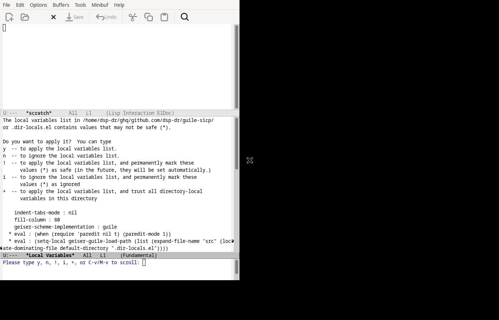
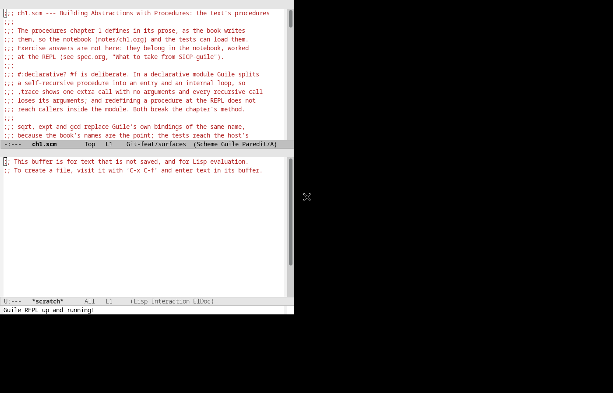

#+TITLE: Interactive debugging from Emacs: the flow, and what is actually proven
#+DATE: 2026-09-29
#+AUTHOR: dsp-dr

Run against =guile-sicp= on nexus, FreeBSD 15.1-RELEASE, =guile3= 3.0.10, GNU
Emacs 30.2, 2026-09-29. Screenshots and the trace artifact are in
[[file:screenshots/][screenshots/]].

* The flow

#+begin_src mermaid
sequenceDiagram
    actor Human as Human in Emacs
    participant DL as .dir-locals.el
    participant Paths as guile-repl-paths.sh
    participant REPL as guile3 --debug --listen :37491
    participant Proxy as proxy :37492
    participant Log as repl.log
    actor Agent

    Note over Paths: 1. derive, never assume
    Paths->>Paths: slug = pwd with / and . as -
    Paths->>Paths: port = 37000 + cksum(slug) mod 900
    Paths->>REPL: start with --debug, load path from detection
    Paths->>Proxy: start on PORT+1, target PORT

    Note over Human,DL: 2. Emacs learns the same numbers
    DL->>Human: geiser-guile-load-path, probed binary
    Human->>Proxy: geiser-connect 127.0.0.1 37492

    Note over Human,Log: 3. both clients, one transcript
    Human->>Proxy: ,trace (fib 5)
    Proxy->>REPL: forwarded verbatim
    REPL-->>Proxy: trace: | | (fib 3) ...
    Proxy->>Log: -> and <- with timestamps
    Proxy-->>Human: the call tree
    Agent->>Proxy: (fib 10)
    Proxy->>Log: recorded the same way
#+end_src

The point of the arrangement: *the debugger is not a second channel*. =,trace=,
=,bt=, =,break= and =,profile= travel the same socket as ordinary evaluation, so
one proxy records a human's Geiser session and an agent's evaluation in one
transcript, in order.

* What the screenshots prove, and what they do not

** 01 --- a =.dir-locals.el= prompt blocks startup, silently

Emacs sitting on *"The local variables list ... contains values that may not be
safe"*, waiting for =y=. =guile-sicp='s =.dir-locals.el= uses =eval:= forms ---
as every useful one does, including the one this plugin's agent writes --- and
those are governed by =enable-local-eval= (default =maybe=), which
=enable-local-variables :all= does *not* cover.

In a scripted or headless run this is indistinguishable from a hang. It is the
first thing anyone automating Emacs against a Guile project will hit.

*Proven:* the prompt happens, and it blocks.

** 02 --- Geiser connected to the proxy

=ch1.scm= in =(Scheme Guile Paredit/A)=, no menu bar, no safety prompt, and
*"Guile REPL up and running!"* in the minibuffer. Geiser is attached to *37492*,
the proxy --- not 37491, the REPL --- so the human's session is recorded.

*Proven:* the whole chain up to and including a live Geiser connection, on a
headless display, from a project-local Emacs profile that never touches
=~/.emacs.d=.

** 03 --- =,trace= through the proxy

[[file:screenshots/03-trace-call-tree.txt]]

=,trace (fib 5)= and its call tree, taken from the transcript the proxy wrote. 168
=trace:= lines are recorded there.

*Proven:* tracing works over the socket and the proxy records it.

*Not proven, and stated plainly:* there is no screenshot of that call tree
*rendered inside the Geiser buffer*. Emacs connects (02) and the trace runs (03),
but driving input into a Geiser REPL without a window manager did not work:
=xdotool= key events do not route with no WM running, and sending to the comint
process from a timer left the forms in the buffer unsubmitted. The honest state is
two proven halves and an unproven join.

* Integration and contract points

Each row is a place where two components must agree, and what breaks when they do
not.

| Point                     | Agreement required                                   | Failure when it breaks          |
|---------------------------+------------------------------------------------------+---------------------------------|
| port derivation           | =guile-repl-paths.sh= and Emacs must compute the same number | Geiser connects to nothing, or to another project |
| proxy vs REPL port        | Emacs must use =PORT+1=                              | session works but is *not recorded* |
| load path                 | detection, not =src/= --- only 43% of 48 checkouts use =src/= | =(use-modules ...)= fails with no hint |
| interpreter name          | probe =guile3= → =guile-3.0= → =guile=; never pin      | works on one platform only (~8178314~; two corpus projects pin it today) |
| =--debug=                 | the REPL must be started with it                      | =,bt= shows no frames, =,trace= reports no calls |
| =enable-local-eval=       | the profile must set it, not just =enable-local-variables= | startup blocks on a prompt      |
| profile loading           | =emacs -q -l <profile>/init.el=, *not* =--init-directory= | the profile silently does not load |
| data root                 | =${CLAUDE_PLUGIN_DATA}=, handed over explicitly       | transcripts land in the deprecated root |
| one client at a time      | the accept loop is serial                             | Emacs and an agent contend      |

The last one is unresolved and is the real limit of this design: a human in Geiser
and an agent evaluating cannot hold the proxy simultaneously. Two proxies, or an
accept-per-connection rewrite, is the fix.

* Reproducing it

#+begin_src sh
cd <a guile project>
sh <plugin>/skills/repl-server/scripts/guile-repl-server.sh      # REPL + proxy
sh <plugin>/scripts/guile-project-detect.sh                      # load path
printf '(use-modules (m))\n,trace (f 5)\n' | nc -N 127.0.0.1 <PORT+1>
#+end_src

For Emacs, =gmake dx= builds the session; the profile in =emacs/init.el= probes
the binary, installs geiser, paredit and keycast into =.dx-emacs/elpa/=, and sets
=enable-local-eval=.
